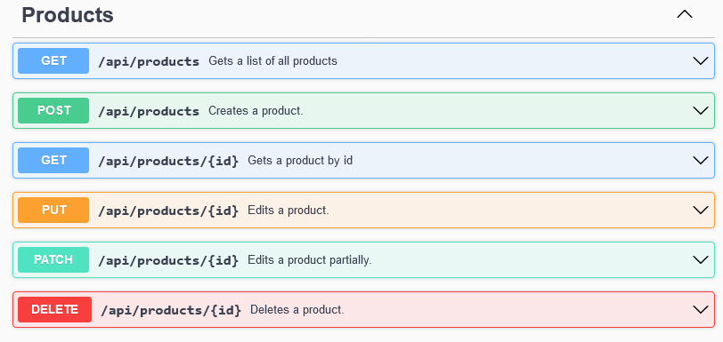

# Products API

This is a simple RESTful API for managing products. It allows you to create, read, update, and delete products.
The API also returns appropriate HTTP status codes for each request, such as `200 OK` for successful `GET` requests, `201 Created` for successful `POST` requests, `204 No Content` for successful `PUT` and `PATCH` requests, and `404 Not Found` for requests that reference non-existent resources.

## Getting Started

To get started with the API, you need to have the following software installed on your machine:

- [.NET 6 SDK](https://dotnet.microsoft.com/download/dotnet/6.0)

Once you have the required software installed, you can clone the repository and run the API using the following commands:

```bash
git clone https://github.com/your-username/products-api.git
cd products-api
dotnet run
```

The API will be available at `http://localhost:{yourPort}}`.

## API Endpoints

The following endpoints are available in the API:

- `GET /api/products`: Returns a list of all products.
- `GET /api/products/{id}`: Returns a product by ID.
- `POST /api/products`: Creates a new product.
- `PUT /api/products/{id}`: Updates a product by ID.
- `PATCH /api/products/{id}`: Partially updates a product by ID.
- `DELETE /api/products/{id}`: Deletes a product by ID.

## API image

