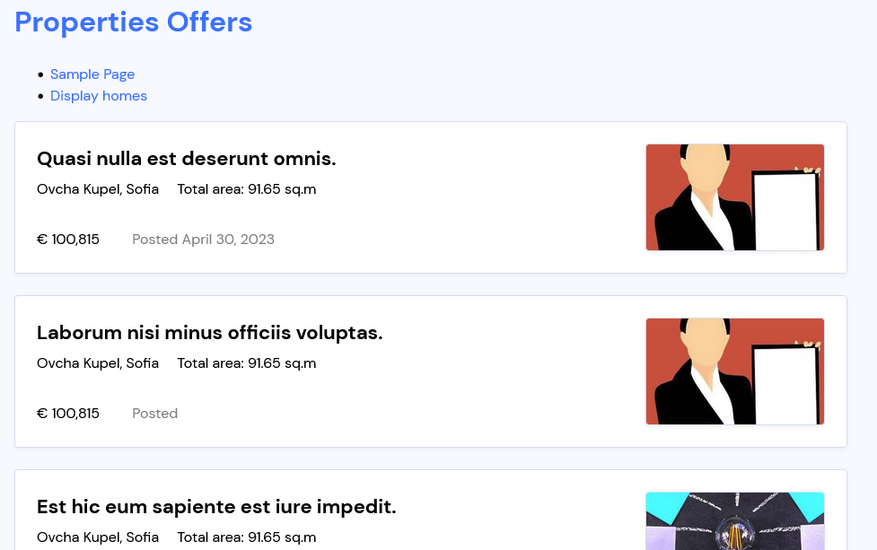

## Wordpress_For_Developers_Exam_Project
 My exam project for the softuni wordpress for developers course | Date: 30.04.2023

### Theme

- The theme is for handling properties for rent.

- Screenshots:

### Plugin

- Plugin for counting visits and likes
- It adds custom taxonomy for property

